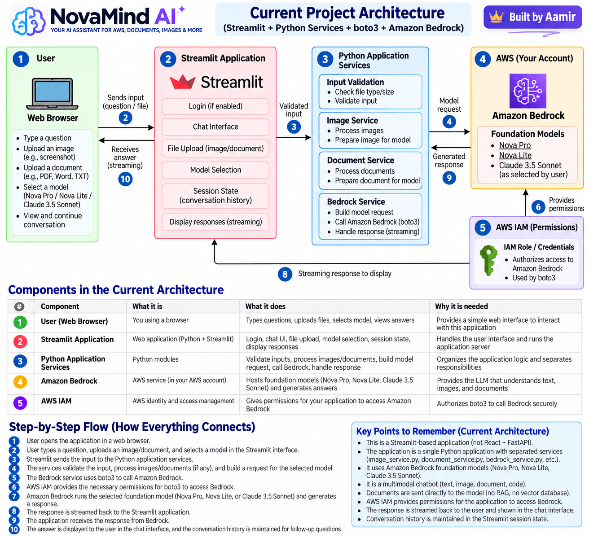

# 02 — Project Architecture

## Question

> **Based strictly on Codex’s analysis of my actual project, can you explain the current architecture of my project from zero in very simple English?**
>
> Please explain:
>
> * What each component is
> * What each component does
> * Why it is needed
> * How all the components connect
>
> Then create a clear **architecture diagram of my CURRENT project**.
>
> Do not add any technology, AWS service, or component that is not currently implemented in my project.
>
> After creating the diagram, explain the architecture **step by step** so I can understand it properly and later explain it confidently in an interview.
>
> **Do not discuss the improved/V2 architecture yet. Focus only on my current architecture.**

---

# Answer

## Current Architecture Diagram




## 1. First: What does "architecture" mean?

In very simple words:

**Architecture means how different parts of your application are organized and how they communicate with each other.**

Your current NovaMind AI architecture is basically:


```text
User
  ↓
Web Browser
  ↓
Streamlit Application
  ↓
Python Services
  ↓
boto3
  ↓
Amazon Bedrock
  ↓
Foundation Model
  ↓
Generated Response
  ↓
Streamlit
  ↓
User
```

Codex describes your project as a **layered monolith**. This means it is one running Python/Streamlit application, but internally the code is separated into different modules with different responsibilities. 

This is important:

**Your current project is NOT:**

```text
React → FastAPI → Microservices
```

It is primarily:

```text
Streamlit + Python Services + boto3 + Amazon Bedrock
```

---

# 2. Current Architecture Diagram

Save the architecture image we created as:

```text
NovaMind-AI-Learning/
│
├── 01-Project-Overview.md
├── 02-Project-Architecture.md
│
└── images/
    └── NovaMind-AI-Current-Architecture.png
```

Then add this inside `02-Project-Architecture.md`:


## Current Architecture Diagram


---

# 3. Component 1 — User / Web Browser

The first component is simply the **user**.

The user opens NovaMind AI through a web browser.

From there, the user can:

* Type a question
* Upload an image
* Upload a document
* Select a foundation model
* Select persona/language/settings
* Continue a conversation
* View the generated answer

Codex found that the application supports text conversations and questions about uploaded images/documents. 

For example:

```text
User uploads:

aws-error.png

Question:

"Why am I getting this AWS error?"
```

The browser does **not directly communicate with Amazon Bedrock**.

It communicates with Streamlit.

```text
User
 ↓
Browser
 ↓
Streamlit
```

---

# 4. Component 2 — Streamlit Application

## What is Streamlit?

Streamlit is a Python framework that allows you to create web applications using Python.

In your project, Streamlit provides the user-facing application.

Codex found that Streamlit handles the browser interface and application server; there is currently no separate React frontend or REST backend. 

### What does Streamlit handle?

It handles things such as:

```text
Streamlit
│
├── Demo Login
├── Chat Interface
├── File Upload
├── Model Selection
├── Persona Selection
├── Language Selection
├── Temperature
├── Maximum Output
├── Session State
├── Conversation Display
└── Streaming Response Display
```

### Why do we need Streamlit?

Without Streamlit, the user would not have this web interface.

Instead of running something manually like:

```bash
python chatbot.py
```

and interacting only through a terminal, Streamlit gives users a browser-based application.

---

# 5. Is Streamlit the frontend or backend?

This is an important concept.

Normally, you might see:

```text
React
  ↓
FastAPI
  ↓
Application Logic
```

Here React is the frontend and FastAPI is the backend.

But your current project does not work like this.

You have:

```text
             Streamlit
          /             \
       Web UI         Python
```

Streamlit provides the user interface **and runs the Python application server**.

Therefore, you currently don't have a separately deployed frontend and backend. 

---

# 6. Component 3 — Python Application Services

Behind the Streamlit UI, your application contains Python modules responsible for different jobs.

Codex identified important modules including:

```text
services/
│
├── bedrock_service.py
├── image_service.py
└── document_service.py

utils/
│
└── validators.py
```


Instead of putting everything into one giant Python file, the project separates responsibilities.

Let's understand them.

---

# 7. Validators

The validators help determine whether uploaded input is acceptable and route it to the appropriate processing service.

Conceptually:

```text
User Upload
     ↓
 Validators
     ↓
"What kind of file is this?"
     ↓
 ┌─────────────┐
 │             │
Image       Document
 │             │
 ▼             ▼
Image       Document
Service      Service
```

This separation makes the application easier to understand and maintain.

---

# 8. Image Service

Suppose the user uploads:

```text
aws-error.png
```

The image service handles the image-processing path.

Codex found that `image_service.py` deals with image size/signature checks, dimensions, processing, and thumbnails. 

Conceptually:

```text
Uploaded Image
      ↓
Image Service
      ↓
Check / Process
      ↓
Prepare for model request
```

It does **not generate the AI answer**.

It prepares the image so that the application can send it to the model.

---

# 9. Document Service

Suppose instead you upload:

```text
report.pdf
```

The document service handles that path.

Codex found that it performs document checks, API format selection, preview extraction, and document naming. 

Conceptually:

```text
report.pdf
    ↓
Document Service
    ↓
Validate / Process
    ↓
Prepare document
    ↓
Bedrock request
```

---

# 10. Component 4 — Bedrock Service

Now we reach one of the most important parts of the application:

```text
bedrock_service.py
```

This module is responsible for communicating with Amazon Bedrock.

Codex found that it builds model requests, streams responses, performs fallback behavior, and updates model history. 

Think about it as a bridge:

```text
Your Application
       ↓
Bedrock Service
       ↓
     boto3
       ↓
Amazon Bedrock
```

---

# 11. Component 5 — boto3

This is another concept you should understand well.

**boto3 is the AWS SDK for Python.**

SDK means:

**Software Development Kit**

It allows your Python code to communicate programmatically with AWS services.

So your application doesn't manually open the AWS Console and click Bedrock.

Your Python code essentially says:

```text
"Amazon Bedrock, here is my request."
```

through boto3.

Codex found that normal chat uses Bedrock Runtime's `converse_stream`, while the connection check uses `converse`. 

Conceptually:

```text
Python
   ↓
boto3
   ↓
AWS API
   ↓
Amazon Bedrock
```

---

# 12. Component 6 — AWS IAM

Now AWS has an important question:

> Is this application actually allowed to call Amazon Bedrock?

That's where **IAM** comes in.

IAM stands for:

**Identity and Access Management**

Think about IAM as an authorization/security layer.

```text
Application
     ↓
   boto3
     ↓
AWS checks permissions
     ↓
"Is this identity allowed
to invoke Bedrock?"
     ↓
   Allowed
     ↓
Amazon Bedrock
```

Codex found IAM is responsible for permission to invoke the models. 

One important correction:

Don't think:

```text
Data → IAM → Bedrock
```

IAM isn't processing your document or AI request.

IAM controls **whether the API request is permitted**.

---

# 13. Component 7 — Amazon Bedrock

Now we arrive at the main AWS Generative AI service.

**Amazon Bedrock provides access to hosted foundation models.**

Your application does not host its own GPU or model weights.

Codex specifically found:

> “The repository contains no model weights or GPU-serving infrastructure.” 

That's an important interview point.

Your architecture is:

```text
Your Application
       ↓
Amazon Bedrock
       ↓
Managed Foundation Model
```

AWS manages the underlying model-serving infrastructure.

---

# 14. Foundation Models

Your application currently provides three selectable model IDs:

```text
Amazon Bedrock
│
├── Nova Pro
├── Nova Lite
└── Claude 3.5 Sonnet
```


The **foundation model generates the AI answer**.

That's an important distinction.

Streamlit doesn't generate the answer.

boto3 doesn't generate the answer.

IAM doesn't generate the answer.

Your Python service doesn't generate the answer.

The selected **foundation model** generates it.

---

# 15. Let's Follow One Real Request

Now let's connect everything.

Suppose you upload:

```text
aws-error.png
```

and ask:

> **“Why am I getting this AWS error?”**

---

### Step 1 — Browser

You open NovaMind AI.

```text
USER
 ↓
Browser
```

---

### Step 2 — Streamlit

Streamlit displays:

```text
Chat box
Upload button
Model selector
Settings
```

You upload the screenshot and type your question.

```text
Browser
   ↓
Streamlit
```

---

### Step 3 — Upload processing

Your application determines that the uploaded file is an image.

```text
aws-error.png
      ↓
Validators
      ↓
Image Service
```

The application validates/processes it.

---

### Step 4 — Bedrock request

Now the Bedrock service prepares the model request.

The request can contain:

```text
Question
+
Image
+
Previous conversation
+
System instructions
+
Inference settings
```

Codex confirmed this request construction flow. 

---

### Step 5 — boto3

The Bedrock service uses:

```text
boto3
```

to call Amazon Bedrock.

```text
Bedrock Service
       ↓
     boto3
       ↓
Amazon Bedrock
```

---

### Step 6 — IAM authorization

AWS verifies whether the application's AWS identity has permission to invoke Bedrock.

If permitted, the request can proceed.

---

### Step 7 — Foundation model

Suppose the user selected:

**Nova Pro**

Then the selected foundation model processes the supplied input and generates the answer.

Conceptually:

```text
Question
+
Screenshot
       ↓
Nova Pro
       ↓
Generated explanation
```

---

# 16. Streaming Response

Your application uses streaming.

This means it doesn't necessarily wait for the entire answer before displaying it.

You might see:

```text
"The error shown..."
```

then:

```text
"The error shown in your screenshot..."
```

then:

```text
"The error shown in your screenshot indicates
that your IAM role..."
```

until the complete response arrives.

Codex confirmed that text fragments update a Streamlit placeholder while generation continues. 

So:

```text
Foundation Model
       ↓
Amazon Bedrock
       ↓
Bedrock Service
       ↓
Streaming
       ↓
Streamlit
       ↓
USER
```

---

# 17. Conversation History

Now suppose the AI explains the screenshot.

You ask:

> “How can I fix it?”

How does the AI know what **“it”** means?

Your application maintains conversation history.

Codex found two different histories:

**`chat_history`**

Used for displaying/exporting readable conversations.

**`bedrock_history`**

Used when constructing subsequent requests to the model. 

Conceptually:

```text
Question 1
   ↓
Answer 1
   ↓
Question 2
   ↓

Previous history
+
Question 2
      ↓
Bedrock
```

---

# 18. Very Important — Does Bedrock Remember the Conversation?

Not automatically in the way you might initially imagine.

Your **application manages the history**.

For subsequent requests, previous messages are sent again.

Codex explicitly identified this behavior. 

So conceptually:

```text
Your Application

Question 1
Answer 1
Question 2
Answer 2
   ↓
Stores conversation
in session state
```

Then later:

```text
Previous History
       +
New Question
       ↓
Amazon Bedrock
```

---

# 19. Where is conversation history stored?

Currently it is maintained in **Streamlit session state**.

It is not a persistent database.

Therefore, the current architecture does not provide durable conversation recovery after session loss or restart. 

Don't worry about fixing that yet.

We're only understanding the current architecture.

---

# 20. Is this RAG?

**No.**

This is important for interviews.

For document Q&A, Codex found that your project performs **direct document prompting**. 

Current architecture:

```text
Document
   ↓
Application
   ↓
Bedrock
   ↓
Foundation Model
   ↓
Answer
```

There is currently no:

```text
Chunking
   ↓
Embeddings
   ↓
Vector Database
   ↓
Similarity Search
   ↓
Retrieved Context
```

Therefore, don't describe this project as a RAG application.

---

# 21. Complete Current Architecture

Now put everything together:

```text
                         USER
                           │
                  Question / Upload
                           │
                           ▼
                     WEB BROWSER
                           │
                           ▼
                       STREAMLIT
                 ┌─────────┴─────────┐
                 │                   │
               Chat             Session State
                 │             Conversation History
                 │
                 ▼
              VALIDATORS
                 │
          ┌──────┴──────┐
          ▼             ▼
   IMAGE SERVICE   DOCUMENT SERVICE
          │             │
          └──────┬──────┘
                 ▼
          BEDROCK SERVICE
                 │
               boto3
                 │
                 ▼
         AMAZON BEDROCK
                 │
       IAM authorizes access
                 │
                 ▼
         FOUNDATION MODEL
       Nova / Claude selected
                 │
                 ▼
        GENERATED RESPONSE
                 │
              Streaming
                 │
                 ▼
             STREAMLIT
                 │
                 ▼
                USER
```

That's the **current NovaMind AI architecture** based on the repository Codex analyzed.

---

# 22. What should you remember today?

Don't try to memorize everything.

Understand these **six things**:

**1. Streamlit**
Provides your browser UI and runs the Python application.

**2. Python services**
Separate image, document, validation, and Bedrock responsibilities.

**3. boto3**
Allows Python to communicate with AWS.

**4. IAM**
Controls whether your application is authorized to call Bedrock.

**5. Amazon Bedrock**
Provides access to managed foundation models.

**6. Foundation model**
Actually generates the AI response.

So mentally remember:

```text
User
 ↓
Streamlit
 ↓
Python Services
 ↓
boto3
 ↓
Bedrock
 ↓
Foundation Model
 ↓
Response
```

---

# 23. Interview Explanation

Don't memorize this yet. Once you understand the architecture, this is approximately how you could explain it:

> **“NovaMind AI currently uses a layered monolithic architecture built with Python and Streamlit. Streamlit provides the web interface and manages session state. I separated responsibilities such as input validation, image processing, document processing, and Bedrock integration into dedicated Python modules. The Bedrock service uses boto3 to communicate with Amazon Bedrock, while IAM controls authorization for the AWS API calls. The user can select a supported foundation model, and the model processes text, image, or document input. The generated response is streamed back to the Streamlit interface. Conversation history is maintained by the application in Streamlit session state and included with subsequent requests.”**

The important part is being able to explain **why each component exists**, rather than memorizing that paragraph.

---

## Save as

**`02-Project-Architecture.md`**

And place your generated diagram at:

```text
NovaMind-AI-Learning/
├── 01-Project-Overview.md
├── 02-Project-Architecture.md
└── images/
    └── NovaMind-AI-Current-Architecture.png
```

Then reference it inside your Markdown:

```markdown

```

### Next question — Question 3

Once you're comfortable with this architecture, the next question should be:

> **“Using one real example from my project, can you explain the complete request/application flow step by step—from when a user submits a question or uploads an image/document until the final AI response appears on the screen? Explain what happens internally at every stage and which project files/services are involved.”**

That will become **`03-Application-Flow.md`**.
