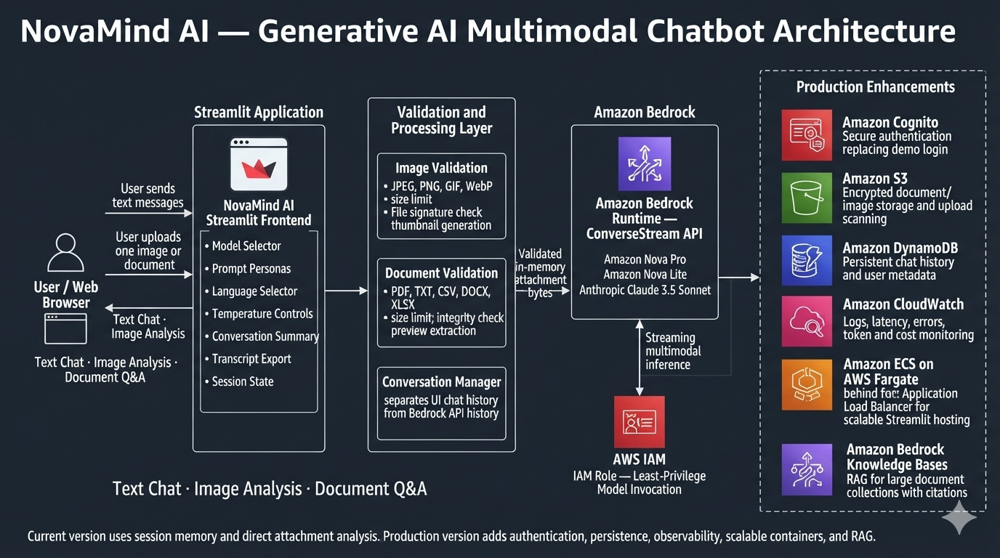

# 🤖 NovaMind AI — Multimodal AI Chatbot on Amazon Bedrock


A **production-oriented, portfolio-level multimodal AI chatbot** powered by **Amazon Nova Pro** on **AWS Bedrock**. Supports natural text conversations, image analysis, and document Q&A — all with real-time streaming responses — built entirely in Python with a clean layered architecture.

> 👨‍💻 **Built by Aamir** · AWS Generative AI Engineer  
> 🔗 [github.com/aamir490](https://github.com/aamir490) · `use-case-3--multimodal-ai-chatbot-aws-bedrock`

---

## 🎯 Project Overview

NovaMind AI demonstrates real-world Generative AI engineering on AWS. It goes beyond a basic tutorial chatbot to showcase:

- **Multimodal AI** — text, images, and documents in a single conversation
- **AWS Bedrock Converse API** — streaming, multi-turn, model-agnostic
- **3 AI model choices** — Amazon Nova Pro, Nova Lite, Claude 3.5 Sonnet
- **Production patterns** — layered architecture, input validation, error handling, security
- **Cost awareness** — live token & USD cost tracking per session
- **Interview-ready** — full documentation, architecture diagrams, Q&A guide

> **Portfolio note:** The sign-in UI uses demo credentials stored in source code. This is not production authentication. Production deployment would use Amazon Cognito.

---

## ✨ Features

| Feature | Details |
|---|---|
| 🔐 **Login Page** | Demo auth with branded login UI. Production → Amazon Cognito |
| 💬 **Text Chat** | Multi-turn conversations with full context memory and streaming |
| 🖼️ **Image Analysis** | Upload JPEG, PNG, GIF, WebP — describe, extract, reason about images |
| 📄 **Document Q&A** | Upload PDF, DOCX, CSV, TXT, MD, HTML — summarise and interrogate |
| 🧠 **3 AI Models** | Nova Pro, Nova Lite, Claude 3.5 Sonnet — switchable mid-session |
| 📋 **Prompt Templates** | 5 built-in personas: Default, Code Reviewer, Data Analyst, Doc Summariser, AWS Educator |
| 🌐 **8 Languages** | English, Arabic, French, Spanish, German, Hindi, Japanese, Chinese |
| 📊 **Token Counter** | Live input/output token count and estimated USD cost per session |
| 🔌 **AWS Health Check** | One-click Bedrock connectivity test with latency measurement |
| 📝 **Conversation Summary** | AI-generated structured summary of the full conversation |
| ⬇️ **Export Transcript** | Download conversation as plain text |
| 🌊 **Streaming Responses** | Token-by-token display with typing cursor |

---

## Screenshots

### Demo sign-in

| Sign-in experience | Alternate capture |
| --- | --- |
|  |  |

### Chat and capabilities

| Welcome dashboard | Text conversation |
| --- | --- |
|  |  |

| Document Q&A | Image analysis |
| --- | --- |
|  |  |

| Code-review persona | Code explanation |
| --- | --- |
|  |  |

## Architecture at a glance

### Architecture Diagram



~~~text
Browser → Streamlit UI → validation/service layer → boto3 → Amazon Bedrock
                   ↑              ↓
           session histories   attachment bytes
~~~

The UI uses separate histories: chat_history stores lightweight information for display/export, while bedrock_history stores Converse API messages that may include binary attachment bytes. The repository does not persist them. See [architecture.md](architecture.md) for the complete design.

## Repository map

~~~text
mod_chatbot_frontend.py       Streamlit UI, session workflow, and controls
services/bedrock_service.py   Bedrock Converse/ConverseStream integration
services/image_service.py     Image validation, orientation, thumbnails
services/document_service.py  Document validation and previews
utils/validators.py           Dispatch, sanitisation, transcript utility
scripts/bedrock_model_access_check.py  AWS/Bedrock diagnostic
project-pic/                  Screenshots shown above
~~~

## 🧠 AI Model — Amazon Nova Pro

| Property | Value |
|---|---|
| **Model ID** | `amazon.nova-pro-v1:0` |
| **Fallback** | `us.amazon.nova-pro-v1:0` (cross-region inference profile) |
| **Provider** | Amazon (AWS-native) |
| **Context window** | 300,000 tokens |
| **Image input** | ✅ JPEG, PNG, GIF, WebP |
| **Document input** | ✅ PDF, CSV, DOCX, XLSX, TXT, HTML, MD |
| **Streaming** | ✅ ConverseStream API |
| **Region** | us-east-1 (primary) |
| **Cost** | $0.80 / 1M input tokens · $3.20 / 1M output tokens |

**Why Nova Pro?** It is the AWS-native model, supports all three modalities (text + image + document) natively in the Converse API, has the best price/performance ratio for portfolio demos, and is already enabled by default in AWS accounts. See [model_selection.md](model_selection.md) for the full comparison against Nova Lite and Claude 3.5 Sonnet.

---

## ☁️ AWS Services Used

| Service | Used | Purpose |
|---|---|---|
| **Amazon Bedrock Runtime** | ✅ | Streaming multimodal inference (Converse + ConverseStream APIs) |
| **Amazon Bedrock** | ✅ | Model discovery and access management |
| **AWS IAM** | ✅ | Authorises Bedrock calls — instance role on EC2, no hard-coded keys |
| **AWS STS** | ✅ | Identity verification in the diagnostic script |
| **Amazon EC2** | ✅ | Hosts the Streamlit application (Ubuntu, t3.micro) |
| **Amazon S3** | ❌ | Not used — files sent as bytes directly to Bedrock |
| **AWS Lambda** | ❌ | Not used — Streamlit is a long-running process |
| **API Gateway** | ❌ | Not used — Streamlit handles its own HTTP |
| **DynamoDB** | ❌ | Not used — session-scoped history only (future improvement) |
| **Amazon Cognito** | ❌ | Not used — demo auth only (future improvement) |

> The app is intentionally minimal — no persistent storage, no API layer, no vector store. The AI inference itself is fully serverless via Bedrock. See [architecture.md](architecture.md) for the complete design rationale.

## 🚀 Run Locally (Windows)

**Requirements:** Python 3.9+, AWS credentials with Bedrock access, Nova Pro model enabled in Bedrock Console, region `us-east-1`.

```powershell
# [PowerShell] — activate venv
.\.venv\Scripts\Activate.ps1

# Install dependencies
pip install -r requirements_new.txt

# Verify AWS + Bedrock access (10 checks)
python scripts/bedrock_model_access_check.py

# Run the app
streamlit run mod_chatbot_frontend.py
```

Open **http://localhost:8501** — login with `demo / demo1234`

Credentials use the standard boto3 chain: environment variables → `~/.aws/credentials` → EC2 IAM role. Never put access keys in source code.

| Variable | Default | Purpose |
|---|---|---|
| `AWS_DEFAULT_REGION` | `us-east-1` | Bedrock Runtime region |
| `BEDROCK_MODEL_ID` | `amazon.nova-pro-v1:0` | Default model |
| `BEDROCK_SYSTEM_PROMPT` | Built-in NovaMind prompt | Assistant persona |

Copy `.env.example` to `.env` to customise any of these values.

## 🌐 Deploy to AWS EC2

```bash
# [EC2 — Ubuntu]
git clone https://github.com/aamir490/use-case-3--multimodal-ai-chatbot-aws-bedrock.git
cd use-case-3--multimodal-ai-chatbot-aws-bedrock
python3 -m venv .venv && source .venv/bin/activate
pip install -r requirements_new.txt
nohup streamlit run mod_chatbot_frontend.py \
  --server.port 8501 --server.address 0.0.0.0 > nohup.out 2>&1 &
```

Open `http://<ec2-public-ip>:8501`. Attach an IAM role with `AmazonBedrockFullAccess` — no credentials needed on the server. See [deployment.md](deployment.md) for full step-by-step instructions.

## 💰 Cost Estimate

| Component | Cost |
|---|---|
| Amazon Bedrock — Nova Pro input | $0.80 / 1M tokens |
| Amazon Bedrock — Nova Pro output | $3.20 / 1M tokens |
| Typical Q&A turn | ~$0.001 – $0.005 |
| 30-min demo session (20 turns) | ~$0.05 – $0.20 |
| EC2 t3.micro | ~$8/month (free tier eligible) |

**No charges when idle** — Bedrock is pay-per-request only. See [cleanup.md](cleanup.md) for teardown instructions.

## 🔐 Security

- ✅ No hard-coded AWS credentials anywhere in source code
- ✅ Credential chain: env vars → `~/.aws/credentials` → EC2 IAM role
- ✅ `.env` in `.gitignore` — never committed
- ✅ File upload validation: size + extension + magic byte integrity checks
- ✅ Path traversal protection in `sanitize_filename()`
- ✅ User input sanitised before sending to model
- ✅ Files sent as bytes — never written to disk permanently
- ✅ IAM role recommended for EC2 (no credentials stored on server)
- ⚠️ Demo auth only — replace with Amazon Cognito before public deployment
- ⚠️ HTTP only — add HTTPS via ALB + ACM for production

## 🔮 Future Improvements

| Priority | Improvement |
|---|---|
| 🔴 **P1** | Amazon Cognito authentication — replace demo login |
| 🔴 **P1** | HTTPS via AWS ALB + ACM certificate |
| 🔴 **P1** | CloudWatch structured logging and metrics |
| 🟡 **P2** | DynamoDB persistent conversation history per user |
| 🟡 **P2** | RAG pipeline via Bedrock Knowledge Bases for multi-document search |
| 🟡 **P2** | Exact token count from Bedrock response metadata |
| 🟢 **P3** | Docker + ECS Fargate containerised deployment |
| 🟢 **P3** | Multi-file attachment support per message |
| 🟢 **P3** | AWS CDK infrastructure-as-code |
| 🟢 **P3** | Bedrock Guardrails for content safety filtering |
| 🟢 **P3** | Voice input/output via Amazon Nova Sonic |

## Interview preparation

[interview.md](interview.md) contains five ready-to-say project stories, AWS service explanations, design trade-offs, and interview questions with answers.

## More documentation

- [architecture.md](architecture.md) — components, request flows, data lifecycle, security, and production evolution.
- [interview.md](interview.md) — interview storytelling and Q&A.
- [deployment.md](deployment.md), [troubleshooting.md](troubleshooting.md), and [model_selection.md](model_selection.md) — supporting guides.
